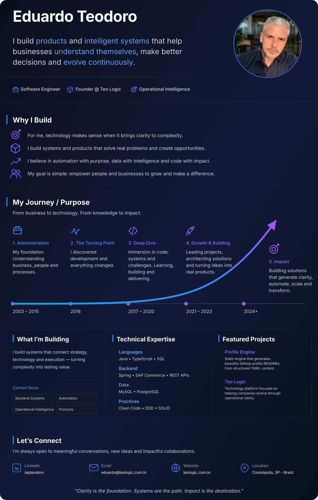

<p align="center">
    
</p>

## Behind This Profile

This profile is generated programmatically by **Profile Engine**, a TypeScript-based rendering engine I built to transform structured profile data into composable SVG documents.

```text
Structured Content
       │
       ▼
   YAML Input
       │
       ▼
 Schema Validation
       │
       ▼
  Profile Engine
       │
       ├── Hero Renderer
       ├── About Renderer
       └── Journey Renderer
       │
       ▼
 SVG Composition
       │
       ▼
  GitHub README
```

The profile above is not a static design asset.

Its content, visual sections and composition are generated from structured data and code through a deterministic rendering pipeline.

**Built with TypeScript, YAML, schema validation and programmatic SVG generation.**

[Explore the Profile Engine repository](https://github.com/GHEPT/profile-engine)
