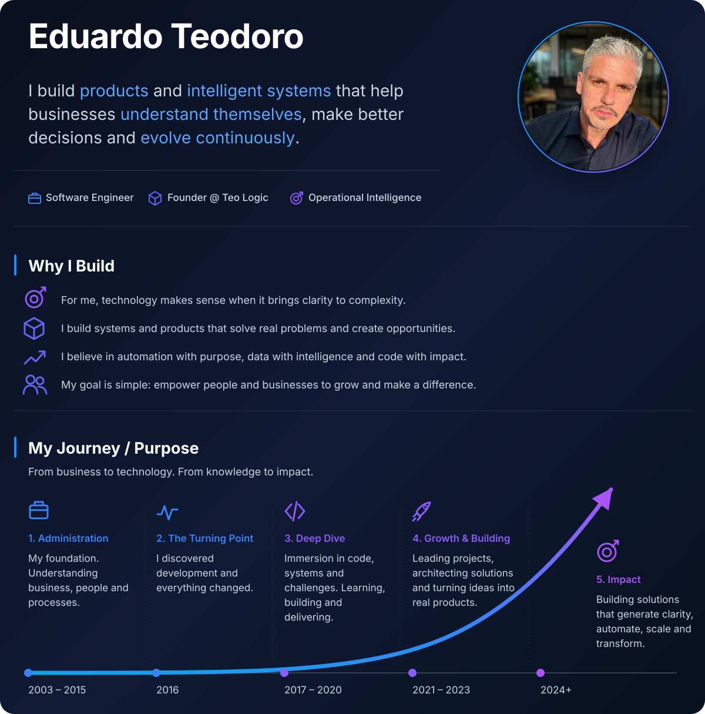
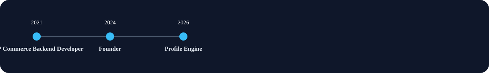

    

## Featured Projects

The following projects represent the products, platforms and systems that best reflect the way I approach software engineering.

### Profile Engine

Static engine that generates beautiful GitHub profile READMEs from structured YAML content.

| Property | Value |
|:---------|:------|
| Category | Developer Tools |
| Status | In Development |
| Technologies | TypeScript, Node.js, SVG, Markdown |

[Repository](https://github.com/GHEPT/profile-engine)

### Teo Logic

Technology platform focused on helping companies evolve through operational clarity.

| Property | Value |
|:---------|:------|
| Category | Business Platform |
| Status | Active |
| Technologies | Next.js, TypeScript, Supabase |

[Website](https://teologic.com.br)

---

## Technologies

- Markdown
- Next.js
- Node.js
- Redis
- SVG
- Supabase
- TypeScript

## Skills

The technologies below represent the tools I use most frequently when building products, backend systems and automation platforms.

### Languages

  

### Backend

  

### Data

 

### Practices

  

## My Journey / Purpose

From business to technology. From knowledge to impact.

### 2003 – 2015 · 1. Administration

**Foundation**

My foundation. Understanding business, people and processes.

### 2016 · 2. The Turning Point

**Transition**

I discovered development and everything changed.

### 2017 – 2020 · 3. Deep Dive

**Technology**

Immersion in code, systems and challenges. Learning, building and delivering.

### 2021 – 2023 · 4. Growth & Building

**Architecture**

Leading projects, architecting solutions and turning ideas into real products.

### 2024+ · 5. Impact

**Purpose**

Building solutions that generate clarity, automate, scale and transform.

## GitHub

My public repositories document ideas, experiments, products and reusable software architecture.

### Engineering Principles

- Build reusable systems
- Prefer composition over inheritance
- Separate content from rendering
- Keep architecture deterministic
- Document everything
- Automate repetitive work

### Open Source

Every public repository represents an idea that has been organized, documented and intentionally engineered.

## Contact

 •  • 

---

Generated by Profile Engine.

